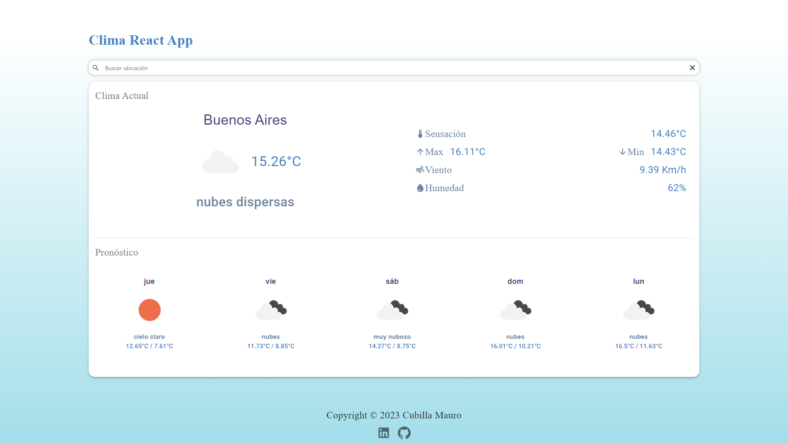

# Clima/Pronóstico React App

App sencilla para la busqueda del clima actual y del pronostico de los siguientes días de una ubicacion elegida.

Es la primera App react que desarrollo con el objetivo de practicar como también para agregarla a mi portafolio.

## Dependencias

- [OpenWeatherMap Api](https://openweathermap.org/)
- [Mapbox Searchbox](https://www.mapbox.com/)
- [Material UI](https://mui.com/)
- axios
- prop-types

## Configuracion

Si queres bajar el proyecto tenes que editar el archivo .env.template con tus propias api keys de openweather y mapbox respectivamente y luego cambiarle el nombre de .env.template a simplemente .env.

Tampoco te olvides de instalar las dependencias: yarn install (en terminal) 

## Prueba y vista previa

Pueden probarla acá: [Climapp](https://climapp-macubi.netlify.app/)

Cualquier feedback/consejo es bienvenido -> [LinkedIn](https://www.linkedin.com/in/macubi90/)

